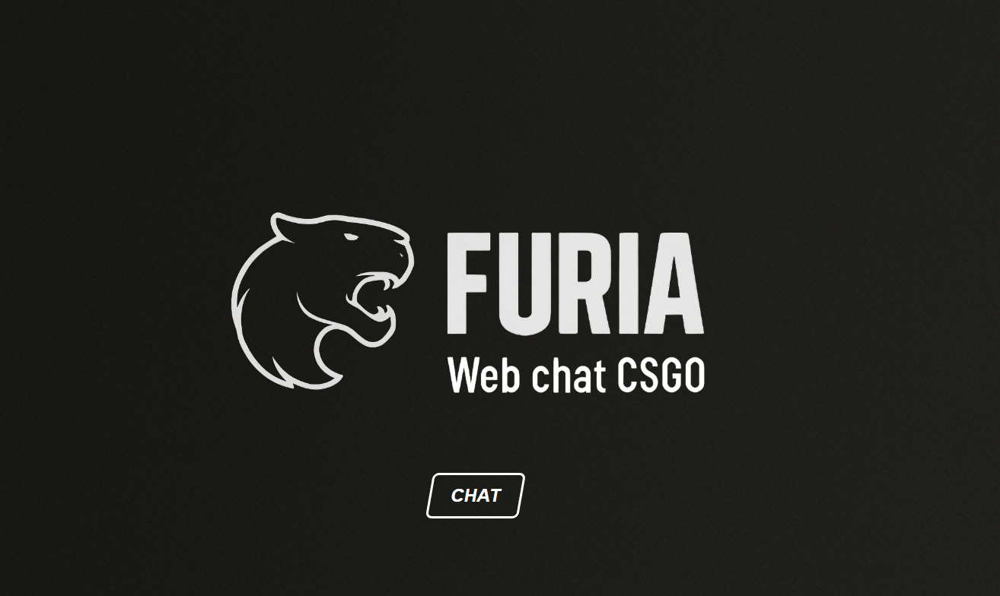

# 🐾 FURIA Chatbot – Aplicação Web com IA e Twitch

Este projeto é um chatbot temático da organização **FURIA Esports**, desenvolvido com **Node.js**, **Express** e **JavaScript puro** no front-end. Ele responde interações do usuário com inteligência artificial, utilizando o modelo **GPT-3.5-turbo da OpenAI** via **OpenRouter**, além de consumir dados ao vivo da **API da Twitch** para exibir canais online da equipe.

---

## 📸 Visão Geral




A interface imersiva, com identidade visual da FURIA, permite que usuários:
- Converse com um bot inteligente contextualizado sobre o universo FURIA
- Consulte canais de criadores de conteúdo da FURIA que estão ao vivo na Twitch
- Acessem rapidamente links úteis (Loja, Últimos jogos)

---

## ⚙️ Tecnologias Utilizadas

| Tecnologia         | Finalidade                                                    |
|--------------------|---------------------------------------------------------------|
| **HTML, CSS, JS**  | Interface web leve e responsiva                               |
| **Node.js + Express** | Backend simples e eficiente para tratar as requisições       |
| **OpenAI GPT-3.5** | Respostas inteligentes via linguagem natural                  |
| **OpenRouter**     | Intermediação entre front-end/backend e a OpenAI              |
| **Twitch API**     | Consulta de canais ao vivo da FURIA em tempo real             |
| **Axios**          | Requisições HTTP simplificadas no back-end                    |
| **dotenv**         | Gerenciamento de variáveis sensíveis                          |

---

## 🗂️ Estrutura do Projeto

```
furia-chatbot/
│
├── public/
│   ├── index.html           # Tela inicial com botão para abrir o chat
│   ├── chat.html            # Interface do chatbot
│   ├── js/chat.js           # Lógica de envio e exibição de mensagens
│   ├── css/style.css        # Estilo da tela inicial
│   ├── css/style-chat.css   # Estilo da tela do chatbot
│
├── server.js                # Servidor Express + integração com APIs
├── package.json             # Dependências e scripts do Node.js
├── .env                     # Chaves e tokens (não incluído no Git)
└── README.md                # Esta documentação
```

---

## 🔧 Configuração

### 1. Clonar o repositório

```bash
git clone https://github.com/seu-usuario/furia-chatbot.git
cd furia-chatbot
```

### 2. Instalar dependências

```bash
npm install
```

### 3. Criar o arquivo `.env`

Crie um arquivo `.env` na raiz com os seguintes dados:

```env
PORT=3000

# Twitch API
TWITCH_CLIENT_ID=sua_client_id
TWITCH_CLIENT_SECRET=seu_client_secret

# OpenRouter (OpenAI via proxy)
OPENROUTER_API_KEY=sua_api_key
```

### 4. Iniciar o servidor

```bash
npm start
```

Acesse: [http://localhost:3000](http://localhost:3000)

---

## 💬 Funcionamento do Chat

- O usuário digita uma mensagem no `chat.html`.
- A mensagem é enviada via `fetch()` para o backend Express (`/api/chat`).
- O backend verifica:
  - Se é uma **palavra-chave pré-programada** (ex: "Ver lives agora").
  - Se não for, envia para a **API da OpenAI** via **OpenRouter**, com contexto.
- A resposta é formatada e retornada para o usuário.

---

## 🧠 Inteligência Artificial

O bot utiliza o modelo:

```
🧠 GPT-3.5-turbo (OpenAI via OpenRouter)
```

Com um prompt personalizado, o bot:
- Se limita ao universo FURIA (time, jogadores, lives, cultura gamer).
- Ignora perguntas fora do escopo.
- Responde com linguagem descontraída e emojis.

---

## 📺 Integração com a Twitch

O sistema se conecta à API da Twitch usando um token OAuth gerado com `client_id` e `client_secret`. Ele verifica periodicamente os seguintes canais:

```
furiatv, guerri, kscerato, yuurih, fallen, chelo, skullzin, sofiaespanha
```

E retorna as lives ativas no momento da requisição.

---


## ✍️ Autor

Desenvolvido por @lucas-sacchi 
